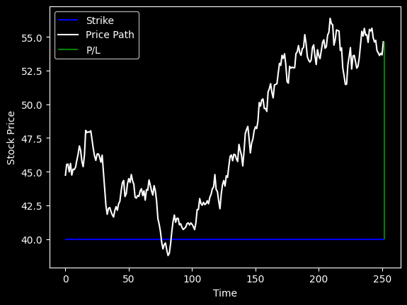

# Black-Scholes Option Pricer & Monte Carlo P/L Simulator
Python implementation of the Black-Scholes-Merton model to price European call and put options, simulating the realised P/L against that price using Monte Carlo paths under Geometric Brownian Motion (GBM).

## What it does

- Prices a European call or put using the Black-Scholes formula
- Simulates a single GBM price path and plots it against the strike, green for a win and red for a loss
- Compares the theoretical price against an example market quote to illustrate a simple "edge" calculation
- Runs 100000 GBM simulations to estimate the average P/L of buying the option at its theoretical fair value

## Assumptions

- The underlying follows Geometric Brownian Motion
- Volatility is constant over the life of the option
- European-style option 

## Example output

Win of 4.26

Call price is 8.977743233509386
Market quote: 8.41 @ 8.73
Edge: 0.24774323350938587

Mean P/L: 0.43